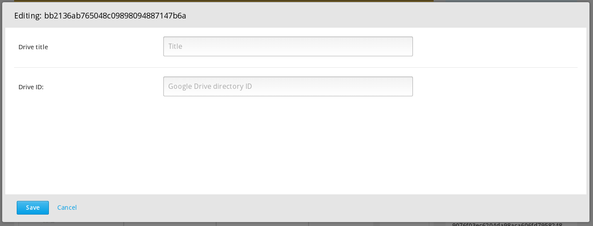

# GoogleDriveXBlock
Based on: https://github.com/edx-solutions/xblock-google-drive

An Open edX platform XBlock to display the directory listings of a Google Drive directory

The XBlock is added like this:

```html
<googledrive drive_id="0B1iqp0kGPjWsNDg5NWFlZjEtN2IwZC00NmZiLWE3MjktYTE2ZjZjNTZiMDY2" title="Example Drive" />
```

The XBlock in Studio looks like this:


Output looks like this:


---
contact: vkaracic@extensionengine.com
